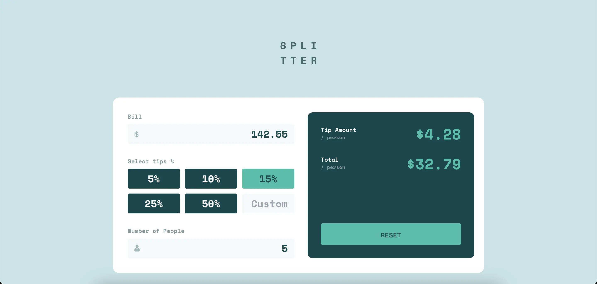

# Frontend Mentor - Tip calculator app solution

This is a solution to the [Tip calculator app challenge on Frontend Mentor](https://www.frontendmentor.io/challenges/tip-calculator-app-ugJNGbJUX). Frontend Mentor challenges help you improve your coding skills by building realistic projects.

## Table of contents

- [Overview](#overview)
  - [The challenge](#the-challenge)
  - [Screenshot](#screenshot)
  - [Links](#links)
- [My process](#my-process)
  - [Built with](#built-with)

## Overview

### Getting started

Run the development server
```bash
npm run dev
# or
yarn dev
```

Open [http://localhost:5173/](http://localhost:5173/) with your browser to see the result.

To learn more about Vite go to [Vite Official Documentation](https://vitejs.dev/).

### The challenge

Users should be able to:

- View the optimal layout for the app depending on their device's screen size
- See hover states for all interactive elements on the page
- Calculate the correct tip and total cost of the bill per person

### Screenshot




### Links

- Solution URL: [FrontendMentor.io](https://www.frontendmentor.io/solutions/responsive-tips-calculator-app-built-with-react-and-tailwindcss-and-formik-NbuR3rCQNQ)
- Live Site URL: [https://revuwem-tip-calculator-app.netlify.app/](https://revuwem-tip-calculator-app.netlify.app/)

## My process

### Built with

- [Vite](https://vitejs.dev/) - build tool
- [React](https://reactjs.org/) - components
- [Typescript](https://www.typescriptlang.org/) - types
- [TailwindCSS](https://tailwindcss.com/) - styles
- [Formik](https://formik.org/) - form management
- [SVGR](https://react-svgr.com/) - SVG transformer
- Semantic HTML5 markup
- Desktop-first workflow

## Author

- Website - [My website](https://karinagrishaeva.notion.site/Frontend-Developer-Portfolio-f922494b44194aa6835cd15899646349)
- Frontend Mentor - [@revuwem](https://www.frontendmentor.io/profile/revuwem)

